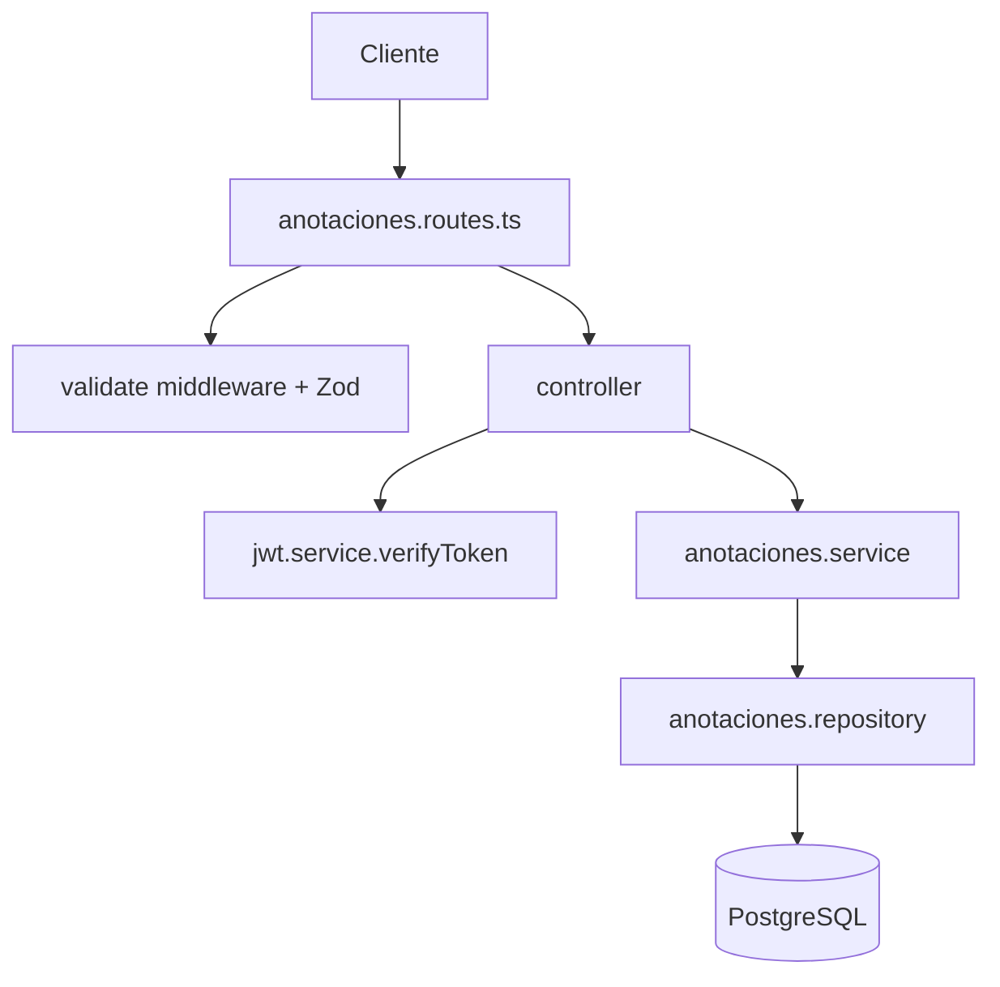

# Design: Registro y visualizacion de anotaciones por docente creador

## Contexto
El microservicio ya esta organizado en capas Express + TypeScript:

```text
src/routes -> src/controllers -> src/services -> src/models -> PostgreSQL
```

La tabla `anotaciones` ya existe en el modelo SQL documentado. La implementacion debe agregar un modulo equivalente al flujo actual de asistencia y cursos, sin introducir dependencias nuevas.

## Archivos probablemente modificados
- `src/app.ts`: registrar `anotacionesRouter` bajo `/api/anotaciones`.
- `src/routes/anotaciones.routes.ts`: rutas y documentacion OpenAPI.
- `src/controllers/anotaciones.controller.ts`: handlers HTTP.
- `src/services/anotaciones.service.ts`: reglas de negocio y autorizacion de dominio.
- `src/models/anotaciones.repository.ts`: queries PostgreSQL.
- `src/schemas/anotaciones.schema.ts`: validacion Zod para body y query params.
- `src/tests/anotaciones.test.ts`: tests de endpoints o comportamiento principal.

## Arquitectura propuesta



## Flujo: registrar anotacion
1. `POST /api/anotaciones` recibe JWT y body.
2. Middleware Zod valida `estudiante_id`, `tipo` y `descripcion`; rechaza campos no permitidos como `docente_id` y `fecha_registro`.
3. Controller valida header `Authorization` y decodifica JWT con `verifyToken`.
4. Controller rechaza si `payload.role !== "Docente"`.
5. Service verifica que el estudiante exista y este activo.
6. Service verifica que el estudiante pertenezca a algun curso asignado al docente.
7. Repository inserta en `anotaciones` usando `docente_id = payload.id`.
8. Repository retorna la fila creada.
9. Controller responde `201`.

## Flujo: listar anotaciones
1. `GET /api/anotaciones` recibe JWT y query params opcionales.
2. Middleware Zod valida filtros y paginacion.
3. Controller decodifica JWT y valida rol docente.
4. Service construye filtros permitidos y fuerza `docente_id = payload.id`.
5. Repository consulta anotaciones con joins a `estudiantes` y `usuarios` para datos basicos del estudiante.
6. Repository ejecuta una query de datos y una query de conteo total.
7. Controller responde `200` con `data` y `meta`.

## Consultas SQL sugeridas

### Verificar estudiante activo

```sql
SELECT e.estudiante_id
FROM estudiantes e
INNER JOIN usuarios u ON u.usuario_id = e.estudiante_id
WHERE e.estudiante_id = $1
  AND u.activo = true;
```

### Verificar acceso docente-estudiante

```sql
SELECT 1
FROM estudiantes e
INNER JOIN curso_asignatura_docente cad ON cad.curso_id = e.curso_id
WHERE e.estudiante_id = $1
  AND cad.docente_id = $2
LIMIT 1;
```

### Insertar anotacion

```sql
INSERT INTO anotaciones (estudiante_id, docente_id, tipo, descripcion)
VALUES ($1, $2, $3, $4)
RETURNING anotacion_id, estudiante_id, docente_id, tipo, descripcion, fecha_registro;
```

### Listar anotaciones del docente

```sql
SELECT
  an.anotacion_id,
  an.estudiante_id,
  u.nombre AS estudiante_nombre,
  u.apellido_paterno AS estudiante_apellido_paterno,
  u.apellido_materno AS estudiante_apellido_materno,
  an.docente_id,
  an.tipo,
  an.descripcion,
  an.fecha_registro
FROM anotaciones an
INNER JOIN estudiantes e ON e.estudiante_id = an.estudiante_id
INNER JOIN usuarios u ON u.usuario_id = e.estudiante_id
WHERE an.docente_id = $1
-- filtros opcionales: estudiante_id, tipo, fecha_desde, fecha_hasta
ORDER BY an.fecha_registro DESC
LIMIT $limit OFFSET $offset;
```

## Validacion

### Body `POST /api/anotaciones`
- `estudiante_id`: number entero positivo.
- `tipo`: enum `positiva`, `negativa`, `observacion`.
- `descripcion`: string trim, minimo 5, maximo 1000.
- Schema estricto para rechazar propiedades no declaradas.

### Query `GET /api/anotaciones`
- `estudiante_id`: string coercible a entero positivo.
- `tipo`: enum opcional.
- `fecha_desde`: string `YYYY-MM-DD` opcional.
- `fecha_hasta`: string `YYYY-MM-DD` opcional.
- `page`: entero positivo default `1`.
- `limit`: entero positivo default `20`, maximo `100`.
- Regla adicional: si existen ambas fechas, `fecha_desde <= fecha_hasta`.

## Manejo de errores
- Reutilizar `errorMiddleware` actual para errores no controlados.
- Para errores de negocio, usar errores con `status` compatible con el middleware actual.
- Mantener formato de respuesta existente:

```json
{
  "success": false,
  "message": "Mensaje de error"
}
```

## Seguridad
- No confiar en `docente_id` enviado por cliente.
- Forzar ownership en query con `WHERE an.docente_id = $1`.
- Validar rol docente antes de operar.
- Validar pertenencia docente-estudiante antes de crear.
- Usar queries parametrizadas con `pg`.
- No exponer datos sensibles de usuarios.

## Observabilidad
- El logging actual con `morgan` cubre requests HTTP.
- Errores no controlados pasan por `errorMiddleware` y quedan en `console.error`.
- No se agrega logging especifico para evitar registrar descripciones de conducta en logs.

## Dependencias nuevas
No se requieren dependencias nuevas.

## Cambios en base de datos
No se requieren cambios estructurales porque `anotaciones` ya existe.

Recomendacion opcional si el volumen crece:

```sql
CREATE INDEX idx_anotaciones_docente_fecha ON anotaciones (docente_id, fecha_registro DESC);
CREATE INDEX idx_anotaciones_docente_estudiante ON anotaciones (docente_id, estudiante_id);
```

Estos indices no son obligatorios para la primera implementacion salvo que exista carga alta o listados frecuentes.

## Estrategia de testing
- Test de registro exitoso con JWT docente.
- Test de rechazo sin token.
- Test de rechazo con rol no docente.
- Test de rechazo si body contiene `docente_id`.
- Test de rechazo para estudiante inexistente o inactivo.
- Test de rechazo si estudiante no pertenece a cursos del docente.
- Test de listado que solo retorna anotaciones del docente autenticado.
- Test de filtros por estudiante, tipo y fechas.
- Test de paginacion.

## Riesgos tecnicos
- El sistema actual repite logica de autenticacion en controllers. Para mantener alcance bajo se puede repetir el patron, pero a mediano plazo conviene extraer middleware `authenticateDocente`.
- El `validate.middleware.ts` actual parsea pero no reemplaza `req.body`/`req.query` con valores transformados por Zod. Si se usan coerciones en query, el controller o service debe normalizar explicitamente o ajustar el middleware.
- Si un docente dicta mas de una asignatura en el mismo curso, la verificacion docente-estudiante puede devolver duplicados. Usar `LIMIT 1` o `EXISTS`.
- No hay migraciones versionadas en el repo; cualquier indice opcional debe documentarse o incorporarse al mecanismo real de despliegue si existe fuera del repositorio.
